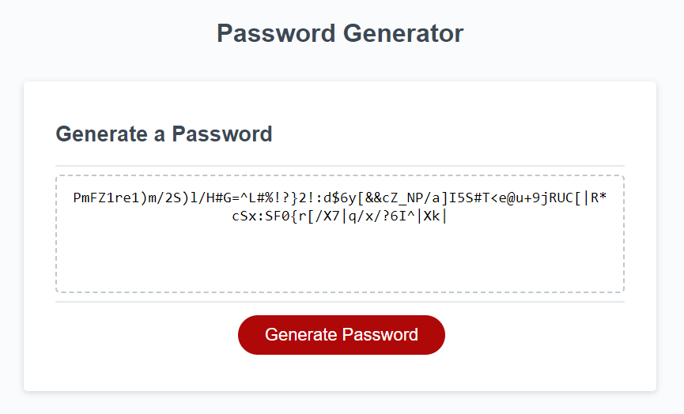

# Password Generator

## Description
This is a website that creates a random password that can range from 8 to 128 characters. You can choose whether you want lowercase characters, uppercase characters, numbers, or special characters. I learned a lot about how arrays work and the importance of javascript for interaction on a website while I was making this project!!

## Visit The Site!

  You can visit the deployed website here: https://shimmyshong.github.io/password-generator/

